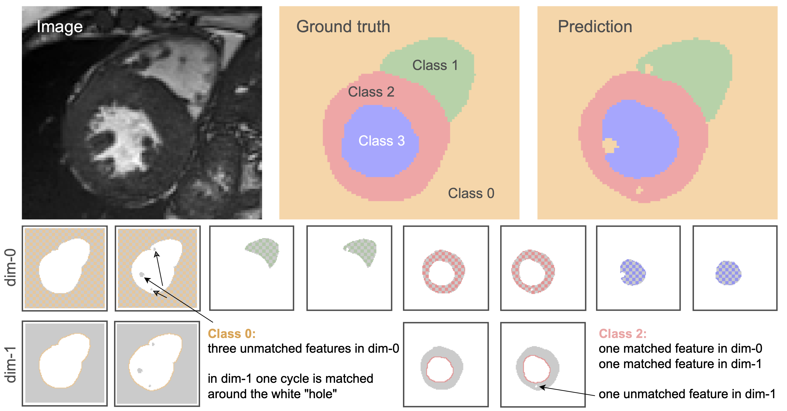

**Multiclass Betti matching**: Extension of topologically faithful loss function to multiclass segmentation
========

**Motivation**. The Betti Matching loss is a general loss function to train binary segmentation networks with strict topological guarantees and correct spatial alignment of topological features based on persitence homology [1]. Other approaches, such as clDice [2] or HuTopo [3], also address the challenge of topological correct image segmentations. However, the realm of topology-preserving multi-class segmentation has not been researched. In this work, we use a one-vs-rest strategy to extend existing loss functions to multiclass settings and compare their performance and characteristics.



**About the code**. We have provided the source code of our extensions for Betti Matching, clDice, and HuTopo along with instructions for the training and evaluation scripts. Please follow the procedure below.


## Usage

### Installation of required packages in virtual environment

1.) Download venv package virtual environment (venv): python3 -m pip install --user virtualenv

2.) Create a virtual environment: python3 -m venv venv

3.) Activate virtual environment: source venv/bin/activate

4.) Use requests to install required packages: pip install -r requirements.txt

### Usage of Betti matching:
We use the optimized c++ BettiMatching implementation [4] to reduce runtime during barcode computation for homolgy-based loss functions. This c++ implementation must be installed and included via PyBind as pip module `betti_matching`.

### Training
1.) To train from scratch using GPU:

python train.py --config configs/platelet_config.yaml

3.) To resume training:

python train.py --config configs/platelet_config.yaml --resume models/platelet/best_model_dict.pth

4.) To use a pretrained model:

python train.py --config configs/platelet_config.yaml --pretrained models/platelet/best_model_dict.pth

<!-- ## Citing Betti matching
If you find our repository useful in your research, please cite the following:
```bibtex
@article{
}
``` -->

<!-- # License
-->

# References

[1] Betti Matching: [[code](https://github.com/nstucki/Betti-matching)][[paper](https://proceedings.mlr.press/v202/stucki23a)]

[2] ClDice: [[code](https://github.com/jocpae/clDice)][[paper](https://arxiv.org/abs/2003.07311)]

[3] HuTopo: [[code](https://github.com/HuXiaoling/TopoLoss)][[paper](https://arxiv.org/abs/1906.05404)]

[4] Efficient Betti Matching: [[code](https://github.com/nstucki/Betti-Matching-3D)][[paper](https://arxiv.org/abs/2407.04683)]
<!-- # Contributing
We actively welcome your pull requests! Please see [CONTRIBUTING.md](.github/CONTRIBUTING.md) and [CODE_OF_CONDUCT.md](.github/CODE_OF_CONDUCT.md) for more info. -->
